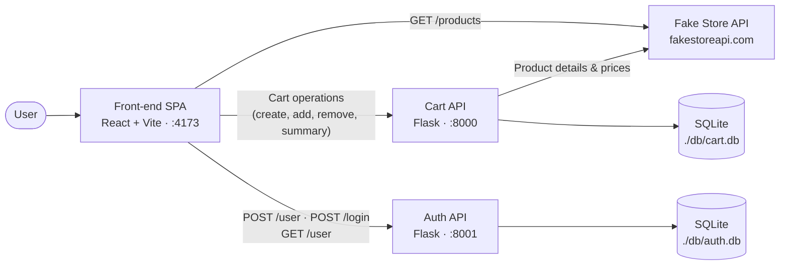

# Back-end APIs — Cart & Auth

Back-end microservices of the online shopping MVP developed for the Software
Architecture post-graduation course (PUC). Both services are built with Flask
and [flask-openapi3](https://luolingchun.github.io/flask-openapi3/) and persist
data in SQLite via SQLAlchemy 2. The cart service integrates with the external
[Fake Store API](https://fakestoreapi.com/).

| Service | Folder | Port | Domain |
| ------- | ------ | ---- | ------ |
| Cart API | [`./cart`](./cart) | `8000` | Shopping carts: create, add/remove products, summaries with prices |
| Auth API | [`./auth`](./auth) | `8001` | Authentication: user registration, JWT login, token validation |

## Stack

- **Python 3.13** + **Flask 3** + **flask-openapi3** (OpenAPI/Swagger docs)
- **SQLAlchemy 2** + **SQLite** for persistence
- **Pydantic** for request/response schemas
- **requests** as the HTTP client for the external store API (cart only)
- **PyJWT** (auth only) to sign and validate JWT session tokens
- **Werkzeug** (auth only) for password hashing

## Architecture Overview

Both services follow a microservice architecture: they are consumed by the
[front-end SPA](https://github.com/ommeirelles/puc-arq-software-front). The
cart service communicates with the Fake Store API to resolve product details
and prices, while the auth service is fully self-contained: it owns its user
database and issues self-signed JWT session tokens.

The auth service manages sessions with stateless JWTs: on login it validates
the credentials against the local `users` table (passwords stored as Werkzeug
hashes) and returns a token signed with the service `SECRET`, carrying the
user id in the `sub` claim and expiring after `TOKEN_TTL_SECONDS`. Token
validation is purely cryptographic — logout is handled client-side by
discarding the token.

Key implementation points (shared by both services):

- Entry point: `src/main.py` — builds the `OpenAPI` app, registers blueprints,
  applies permissive CORS headers, and initializes the database.
- Routes are organized as blueprints in `src/blueprints/`
  (`cart.py` + `product.py` in the cart API, `auth.py` in the auth API).
- Business logic lives in `src/services/`; SQLAlchemy models in `src/models/`;
  Pydantic request/response schemas in `src/schemas/`.
- The SQLite database file is created under `./db/` and named from the
  `DB_NAME` env var (`cart` / `auth`).

## API Documentation

Both APIs provide interactive OpenAPI/Swagger documentation at the `/openapi`
endpoint when running.

### Cart API Endpoints

| Method   | Path                   | Description                                                        |
| -------- | ---------------------- | ------------------------------------------------------------------ |
| `GET`    | `/cart`                | Creates a new cart; returns `{id, guid, deleted}`.                 |
| `GET`    | `/cart/summary?guid=`  | Cart summary: items plus total price.                              |
| `POST`   | `/product/<product_id>`| Adds a product to a cart (`cart_guid`, `quantity` query params).   |
| `DELETE` | `/product/<row_id>`    | Removes a cart entry (`cart_guid` query param).                    |

### Auth API Endpoints

| Method | Path     | Description                                                            |
| ------ | -------- | ---------------------------------------------------------------------- |
| `POST` | `/user`  | Registers a new user `{name, email, password}` (all required, valid email format); returns `{id, name, email}`. Responds `409` when the email is already registered, `422` on invalid payloads. |
| `POST` | `/login` | Authenticates `{email, password}`; returns a signed JWT `{token}`.     |
| `GET`  | `/user`  | Validates the `Authorization: Bearer` JWT; returns the user info.      |

## Environment Variables

### Cart API

| Variable          | Default                      | Purpose                                   |
| ----------------- | ---------------------------- | ----------------------------------------- |
| `PORT`            | `8000`                       | HTTP port exposed to the host             |
| `SECRET`          | `MY_SECRET_KEY`              | Flask secret key                          |
| `DB_NAME`         | `cart`                       | SQLite database file name (under `./db`)  |
| `ENV`             | `production`                 | `development` enables debug/SQL echo      |
| `PRODUCT_API_URL` | *(none — required)*          | External product API base URL; set by the makefile / compose file to `https://fakestoreapi.com/` |
| `OTEL_SERVICE_NAME` | `puc-arq-soft-cart`        | Service name reported in telemetry        |
| `OTEL_EXPORTER_OTLP_PROTOCOL` | `grpc`       | OTLP exporter protocol (`grpc` or `http/protobuf`) |
| `OTEL_EXPORTER_OTLP_ENDPOINT` | `http://localhost:4317` (`grpc`) or `http://localhost:4318` (`http/protobuf`) | OTLP collector endpoint |

### Auth API

| Variable            | Default                      | Purpose                                   |
| ------------------- | ---------------------------- | ----------------------------------------- |
| `PORT`              | `8001`                       | HTTP port exposed to the host             |
| `SECRET`            | `MY_SECRET_KEY`              | Flask secret key / JWT signing key        |
| `DB_NAME`           | `auth`                       | SQLite database file name (under `./db`)  |
| `ENV`               | `production`                 | `development` enables debug/SQL echo      |
| `TOKEN_TTL_SECONDS` | `3600`                       | How long a JWT session token stays valid  |
| `OTEL_SERVICE_NAME` | `puc-arq-soft-auth`          | Service name reported in telemetry        |
| `OTEL_EXPORTER_OTLP_PROTOCOL` | `grpc`         | OTLP exporter protocol (`grpc` or `http/protobuf`) |
| `OTEL_EXPORTER_OTLP_ENDPOINT` | `http://localhost:4317` (`grpc`) or `http://localhost:4318` (`http/protobuf`) | OTLP collector endpoint |

## Running

Each service has its own `Dockerfile` and `Makefile` inside its folder — run
the commands below from `./cart` or `./auth`.

### Docker

The easiest way to run each application is using Docker. Make sure you have
Docker installed on your system.

There is a Makefile on each service's root to enable easy runs with Docker. If
you have `make` and Docker available, you should get it running with:

- `make run` — builds and runs the Docker image, exposing the API on its port
  (**8000** for cart, **8001** for auth) to the host (with the `./db` folder
  mounted for persistence).
- `make dev` — runs the same image with `./src` and `./db` mounted and
  `ENV=development`, so Flask reloads on each code change.
- `make stop` — stops and removes the container.

*It's also possible to run without make:*

- Cart: `docker build -t arq-soft-cart .` then
  `docker run --rm -p 8000:8000 -v ./db:/app/db -e PRODUCT_API_URL=https://fakestoreapi.com/ arq-soft-cart`
- Auth: `docker build -t arq-soft-auth .` then
  `docker run --rm -p 8001:8001 -v ./db:/app/db arq-soft-auth`

> Docker is used through the Podman compatibility layer.

> To run the **full stack** (both APIs, the front-end, OTEL collector and
> Jaeger), use the `docker-compose.yml` at the root of the
> [front-end repository](https://github.com/ommeirelles/puc-arq-software-front):
> `docker-compose up --build --watch`.

### Locally

Prerequisites:

- Python 3.13

Steps (per service, from its folder):

1. Clone the repository
2. Install dependencies: `pip install -r requirements.txt`
3. Start the server: `python src/main.py`
4. Open `http://localhost:8000/openapi` (cart) or
   `http://localhost:8001/openapi` (auth) for the interactive API docs
